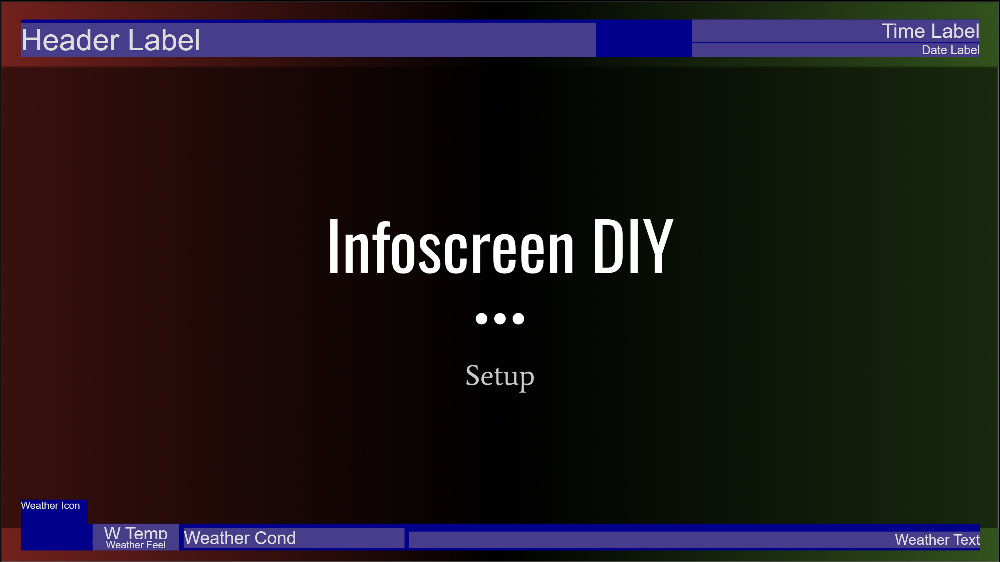

# InfoScreen showing Google Slides


A simple website that embeds and loops thru an Google Slide, with overlay that shows date, time and local weather information.
Useful for implementing a free InfoScreen, that can be edit directly in [Google Slides](https://www.google.com/slides/about/).

---

## Content

- [InfoScreen showing Google Slides](#infoscreen-showing-google-slides)
  - [Content](#content)
  - [Embed Google Slide project](#embed-google-slide-project)
  - [Show local weather data](#show-local-weather-data)
  - [Start the site](#start-the-site)
  - [Customizations](#customizations)
    - [Config Main section](#config-main-section)
    - [Config Section - format](#config-section---format)
    - [Config Section - format - labels](#config-section---format---labels)
    - [Config Section - googleSlide](#config-section---googleslide)
    - [Config Section - weatherService](#config-section---weatherservice)
  - [Appendix](#appendix)
    - [Label positions](#label-positions)
    - [Example config file](#example-config-file)
    - [List of language id's](#list-of-language-ids)
    - [Date time format options](#date-time-format-options)
    - [License](#license)
  - [MIT License](#mit-license)
    - [Copyright (c) 2024 Brian Kristensen](#copyright-c-2024-brian-kristensen)

---

## Embed Google Slide project

> [Content overview](#content)

- Create a [Google Slide project](https://slides.google.com/).

- In Google Slides, go to this menu: 'File' / 'Share' / ['Publish to web'](https://support.google.com/docs/answer/183965?hl=en&co=GENIE.Platform%3DDesktop#publish).

- Copy the Slide Id in the URL

```url
...docs.google.com/presentation/d/e/<SLIDE_ID>/embed?start=true...
```

Example id:
`2PACX-1vSBNy-mN519II3gzObo8p32RhVHaL26vFruRj27zJMnrkyOQ1yyCjQBuYkZqlSvOaIWGQz9Woc_sFVM`

- Open the default config file from /custom/default.conf.js and locate the googleSlide section, and add the Slide Id to the slideId key.

```javascript
googleSlide: {
    slideId: 'ADD YOUR SLIDE ID HERE',
    durationSek: 20,
    reloadSlide: 60, 
}
```

---

## Show local weather data

> [Content overview](#content)

We will use the free Weather API provided by [VisualCrossing.com](https://www.visualcrossing.com).

- Create a [free account](https://www.visualcrossing.com/sign-up) on [VisualCrossing Weather API platform](https://www.visualcrossing.com/weather-api).

- Open the default config file from /custom/default.conf.js and locate the weatherService section.

```javascript
weatherService: {
    showWeather: true,
    key: 'ADD YOUR API KEY HER',
    unitGroup: 'metric',
    location: 'copenhagen,denmark',
}
```

- Enable weather service by setting the key 'showWeather' to true, and add your API key provided by VisualCrossing.

- Set the 'unitGroup' key to 'us' or 'metric' for showing in Fahrenheit or Celsius.

- Remember to set location, to your local address in a format like:
  - `{ADDRESS},{CITY},{COUNTRY}`
  - `{CITY},{COUNTRY}`
  - `{LATITUDE},{LONGITUDE}`

---

## Start the site

> [Content overview](#content)

Just Start [index.html](www/index.html) in an browser and see the result.

---

## Customizations

> [Content overview](#content)

For more customization open the [custom/default.config.js](www/custom/default.config.js) file and edit it as you like.

If you need more than one configuration, you can create as many `*.conf.js` files you need and just load with another setup by adding `?conf=NAME` in the end of the link, like: [index.html?conf=my_setting](www/index.html?conf=my_setting), and then the page will look for [custom/my_setting.conf.js](www/custom/my_setting.conf.js).

### Config Main section

> [Content overview](#content)

|Key|Default|Description|
|---|---|---|
|background_image|'[custom/background.gif](www/custom/background.gif)'||
|widthPrc|97|Width in percent.<br/>You can set it to 100 if you want to remove border on displays with no margin|
|languageId|'en'|[Language Id](#list-of-language-ids) for **weekdays**, **months** and **weather descriptions**.|

### Config Section - format

> [Content overview](#content)

|Key|Default|Description|
|---|---|---|
|dateformat_options|'{timeZone:'UTC'}'|[Date time format}(#date-time-format-options)<br/>EXAMPLE: `{ weekday: 'long', day: 'numeric', month: 'short', year: 'numeric', timeZone: 'UTC'}`||
|time24hours|true|Show hour in 24 hours or false for 12 hours|

### Config Section - format - labels

> [Content overview](#content)

Labels can be formatted as you wish, just add or remove '{?}' as needed and write any text you like.

|Key|Default|Description|
|---|---|---|
|header|'**{0}** InfoScreen DIY'|Header text in left top corner, just set to empty if you don't want any.<br/>    **{0}** will be replaced with the favicon found here: "[custom/favicon.png](www/custom/favicon.png)"|
|date|'**{0}**'|Date label format. <br/>    **{0}** will be replaced with current date in selected language|
|time|'Time **{0}** **{1}**:**{2}**'|Time label format.<br/>    **{0}** will be replaced with am/pm if format.time24hours is false.<br/>    **{1}** will be replaced with current hour.<br/>    **{2}** will be replaced with current minute.<br/>    **{3}** will be replaced with current second|
|temp|'**{0}** °'|Temperature label format. <br/>    **{0}** will be replaced with current temperature in selected unit group.|
|feelslike|'feels like **{0}** °'|Feels Like label. <br/>    **{0}** will be replaced with current feels like temperature in selected unit group.|
|condition|'**{0}**'|Weather condition label. <br/>    **{0}** will be replaced with current weather conditions in selected languageid|
|description|'**{0}**'|Weather description label.<br/>    **{0}** will be replaced with current day weather description in selected languageid.|

### Config Section - googleSlide

> [Content overview](#content)

|Key|Default|Description|
|---|---|---|
|slideId|''|[Published Google Slide id.](https://support.google.com/docs/answer/183965?hl=en&co=GENIE.Platform%3DDesktop#publish)|
|||- In Google Slides, go to this menu: 'File' / 'Share' / 'Publish to web'<br/> -In the embed URL copy the id from `docs.google.com/presentation/d/e/<SLIDE_ID>/embed?start=true...`<br>**Example**: `2PACX-1vSBNy-mN519II3gzObo8p32RhVHaL26vFruRj27zJMnrkyOQ1yyCjQBuYkZqlSvOaIWGQz9Woc_sFVM`|
|durationSek|20|Duration between slides in seconds.|
|reloadSlide|60|Reload Webpage after **?** seconds.<br>Do this in order to get updated slides.|

### Config Section - weatherService

> [Content overview](#content)

|Key|Default|Description|
|---|---|---|
|showWeather|true|Show or hide weather in bottom left corner.|
|key|''|Your personal code for the weather API, sign up at [www.visualcrossing.com/sign-up](https://www.visualcrossing.com/sign-up) and get a free key|
|unitGroup|'metric'|Select the [temperature unit](https://www.visualcrossing.com/resources/documentation/weather-api/unit-groups-and-measurement-units/).<br>- **us**:     Fahrenheit<br>- **metric**: Celsius|
|location|'copenhagen,denmark'|Location is the **address**, **partial address** or **latitude,longitude** location for which to retrieve weather data.<br/>You can also use **US ZIP Codes**.|

---

## Appendix

### Label positions

This is a example of the standard label positions.
To change positions or format, please go to [assets/style.css](www/assets/style.css).



### Example config file

> [Content overview](#content)

```javascript
let config = {
    // The background image is shown while loading the slide.
    background_image: "custom/background.gif",
    // Width in percent, 100 = no margin.
    widthPrc: 97, // in percent
    // Language Id for date and weather data
    languageId: 'en',   
    format: {
        // Set the format of the date by adding options. 
        dateformat_options: {weekday:'long',day:'2-digit',month:'2-digit',timeZone:'UTC'},
        // Show hour in 24 hours or false for 12 hours */
        time24hours: true,
        // Labels can be formatted as you wish, if empty, label is not shown.
        labels: {
            // Header text in left top corner, empty if none.
            //    {0} will be replaced with 'custom/favicon.png'
            header: '{0} InfoScreen DIY',
            // Date label format. 
            //    {0} will be replaced with current date.
            date: '{0}',
            // Time label format.
            //    {0} will be replaced with am/pm.
            //    {1} will be replaced with current hour.
            //    {2} will be replaced with current minute.
            //    {3} will be replaced with current second.
            time:'Time {0} {1}:{2}',
            // Temperature label format.
            //    {0} will be replaced with current temperature.
            temp: '{0}°',
            // Feels Like label.
            //    {0} will be replaced with feels like temperature.
            feelslike: 'feels like {0}°',
            // Weather condition label.
            //    {0} will be replaced with weather condition.
            condition: '{0}',
            // Weather description label.
            //    {0} will be replaced with weather description.
            description: '{0}'
        }
    },
    googleSlide: {
        // Published Google Slide id.
        slideId: 'ADD YOUR SLIDE ID HERE',
        // Duration between slides in seconds.
        durationSek: 20,
        // Reload Webpage after ? seconds.
        //    Do this in order to get updated slides.
        reloadSlide: 60, 
    },
    weatherService: {
        // Show or hide weather info in bottom left corner.
        showWeather: true,
        // Your personal code for the weather api.
        key: 'ADD YOUR API KEY HERE',
        // Select the temperature unit.
        //    us:       Fahrenheit
        //    metric:   Celsius
        unitGroup: 'metric',
        // Location:  is the address, partial address or 
        //    latitude,longitude location or us zip code.
        location: 'london. united-kingdom',
    }
};
define(function () {
    return {
        getConfig: function () {
            return config;
        }
    }
});
```

### List of language id's

> [Content overview](#content)

Language Id for weekdays, months and weather data, can be set by any of the following id's:
|Language Id|Language|
|---|---|
|ar|Arabic|
|bg|Bulgarian|
|cs|Czech|
|da|Danish|
|de|German|
|el|Greek Modern|
|en|English|
|es|Spanish|
|fa|Farsi|
|fi|Finnish|
|fr|French|
|he|Hebrew|
|hu|Hungarian|
|it|Italian|
|ja|Japanese|
|ko|Korean|
|nl|Dutch|
|pl|Polish|
|pt|Portuguese|
|ru|Russian|
|sr|Serbian|
|sv|Swedish|
|tr|Turkish|
|uk|Ukrainian|
|vi|Vietnamese|
|zh|Chinese|

### Date time format options

> [Content overview](#content)

You can change the format of the date by adding any of the following options.
|Key|Values|
|---|---|
|weekday|- 'narrow'<br/>- 'short'<br/>- 'long'|
|year|- 'numeric'<br/>- '2-digit'|
|month|- 'numeric'<br/>- '2-digit'<br/>- 'narrow'<br/>- 'short'<br/>- 'long'|
|day|- 'numeric'<br/>- '2-digit'|
|timeZone|- 'UTC'|

---

### License

> [Content overview](#content)

This project is licensed under the **MIT license**.

Copyrights on the definition files are respective of each contributor listed at the beginning of each definition file.

## MIT License

### Copyright (c) 2024 Brian Kristensen

Permission is hereby granted, free of charge, to any person obtaining a copy of this software and associated documentation files (the "Software"), to deal in the Software without restriction, including without limitation the rights to use, copy, modify, merge, publish, distribute, sublicense, and/or sell copies of the Software, and to permit persons to whom the Software is furnished to do so, subject to the following conditions:

**The above copyright notice and this permission notice shall be included in all copies or substantial portions of the Software.**

> THE SOFTWARE IS PROVIDED "AS IS", WITHOUT WARRANTY OF ANY KIND, EXPRESS OR IMPLIED, INCLUDING BUT NOT LIMITED TO THE WARRANTIES OF MERCHANTABILITY, FITNESS FOR A PARTICULAR PURPOSE AND NONINFRINGEMENT. IN NO EVENT SHALL THE AUTHORS OR COPYRIGHT HOLDERS BE LIABLE FOR ANY CLAIM, DAMAGES OR OTHER LIABILITY, WHETHER IN AN ACTION OF CONTRACT, TORT OR OTHERWISE, ARISING FROM, OUT OF OR IN CONNECTION WITH THE SOFTWARE OR THE USE OR OTHER DEALINGS IN THE SOFTWARE.

---

> [Content overview](#content)
